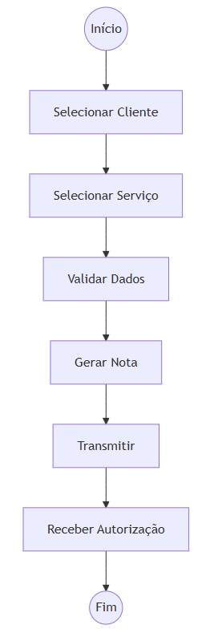
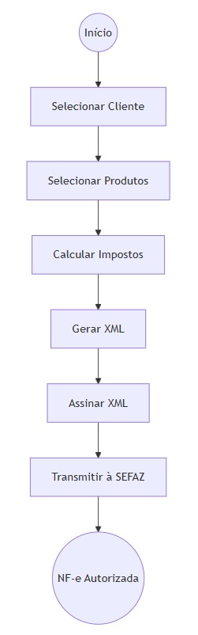
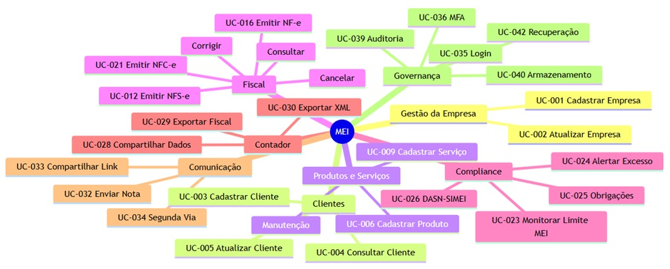

# Casos de Uso Principais
## Gestão da Empresa
### UC-001 Cadastrar Dados do MEI
**Objetivo:** Configurar os dados fiscais da empresa.
**Envolve:**
- CNPJ
- CNAE
- Endereço
- Inscrição Municipal
- Inscrição Estadual
- Certificado Digital

## UC-002 Atualizar Dados Cadastrais
 - Permitir manutenção dos dados **MEI**
---
# Gestão de Clientes
### UC-003 Cadastrar Cliente
- Pessoa Física ou Jurídica.
### UC-004 Consultar Cliente
- Buscar histórico de relacionamento.

### UC-005 Atualizar Cliente
- Manter cadastros válido para emissão fiscal.
---
## Gestão de Produtos
### UC-006 Cadastrar Produto
Dados fiscais e comerciais.
### UC-007 Atualizar Produto
### UC-008 Consultar Produto
---
## Gestão de Serviços
### UC-009 Cadastrar Serviço
### UC-010 Atualizar Serviço
### UC-011 Consultar Serviço
---
# Emissão Fiscal
## NFS-e
### UC-012 Emitir NFS-e
**Fluxo Principal**

### UC-013 Consultar NFS-e
### UC-014 Cancelar NFS-e
### UC-015 Reenviar NFS-e ao Cliente
---
## NF-e
### UC-016 Emitir NF-e
**Fluxo Principal**

### UC-017 Consultar NF-e
### UC-018 Cancelar NF-e
### UC-019 Carta de Correção
### UC-020 Reenviar NF-e
---
## NFC-e (Preparado para Evolução)
### UC-021 Emitir NFC-e
### UC-022 Cancelar NFC-e
---
# Compliance e Obrigações Governamentais
## Faturamento
### UC-023 Monitorar Limite de Faturamento
O sistema acompanha:
- Receita Mensal
- Receita Acumulada
- Percentual do Limite MEI

### UC-024 Alertar Excesso de Faturamento
 - Notificações automárcas

---
## Obrigações
### UC-025 Acompanhar Obrigações do MEI
**Exibir:**
- DAS
- DASN-SIMEI
- Pendências
### UC-026 Gerar Relatório para Declaração Anual
### UC-027 Consultar Histórico Fiscal
---
# Relacionamento com Contador
### UC-028 Compartilhar Informações com Contador
### UC-029 Exportar Movimentação Fiscal
### UC-030 Exportar Documentos Fiscais
### UC-031 Consultar Faturamento Anual
---
# Comunicação
### UC-032 Enviar Nota por E-mail
### UC-033 Gerar Link de Compartilhamento
### UC-034 Gerar Segunda Via
---
# Segurança
### UC-035 Autenticar Usuário
### UC-036 Configurar Métodos de Autenticação
**Funcionalidades sugeridas:**
- Ativar MFA
- Configurar autenticação por e-mail
- Configurar aplicativo autenticador
- Recuperar acesso
- Gerenciar dispositivos confiáveis
### UC-037 Consultar Logs
### UC-038 Gerenciar Certificado Digital
---
# Auditoria e Governança
### UC-039 Registrar Operações
**Registrar:**
- Emissões
- Cancelamentos
- Consultas
- Alterações
 
### UC-040 Armazenar XML
### UC-041 Armazenar DANFE
### UC-042 Recuperar Documento Fiscal
---
# Casos de Uso Estratégicos (Diferencial Comercial)
> Casos normalmente ausentes em emissores simples.
### UC-043 Verificar Risco de Desenquadramento
### UC-044 Simular Faturamento Futuro
### UC-045 Alertar Pendências Fiscais
### UC-046 Dashboard Executivo do MEI
**Indicadores:**
- Receita
- Clientes
- Serviços
- Produtos
- Evolução Mensal
---
# Arquitetura Conceitual do Produto (V1)

 
## Visão Geral

A arquitetura foi concebida para cobrir integralmente o ciclo operacional do MEI:

- Operação do negócio

- Emissão fiscal

- Conformidade governamental

- Relacionamento com contador

- Segurança

- Governança

Além disso, mantém a solução preparada para futuras expansões funcionais.
